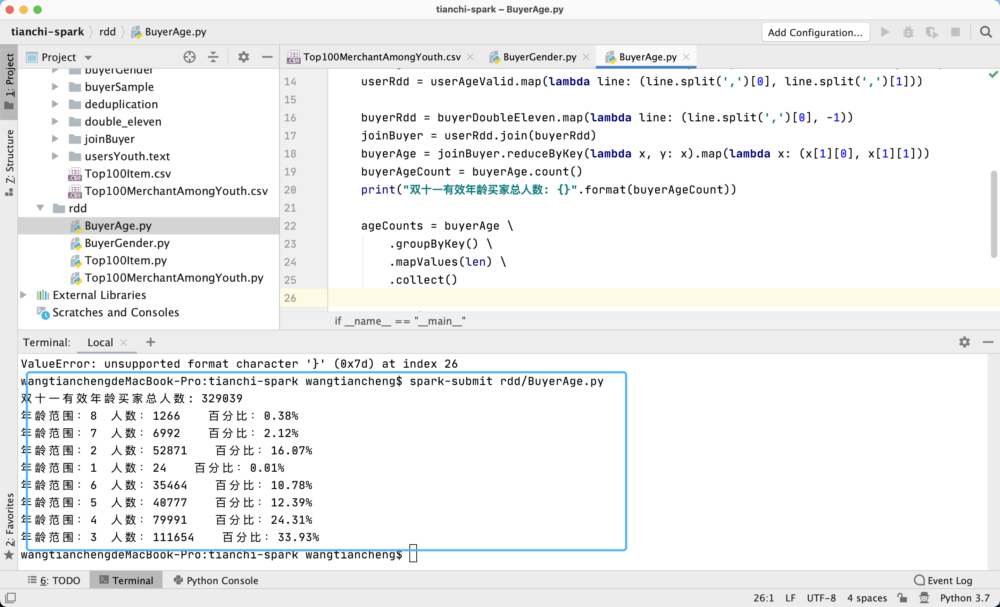

# 天猫复购预测-FBDP实验四报告
<p align="right">181098273 王天诚</p>

## 实验内容

### 1.统计==双十一最热门商品== 和==最受年轻人关注的商家==：

#### 1.1 MapReduce

##### **最热门商品统计** (./mapreduce/src/main/java/com/hadoop/Top100Item.java )

思路：首先设置一个Job用来对==同一用户同一商品同一行为==进行去重，否则会有正确性风险，统计的热度就可能有问题。由于这个数据是日志不是snapshot，一个用户可能可以重复加购再取消再加购，会产生多条加购记录。当然这个表格里具体是怎么样的是不能确定的，得先确认。之后参照作业五中对shakespear进行wordcount排序的思路进行相似处理即可。三个Job的顺序及功能如下：

- Job1: 读入user_log_format1.csv文件，对 (user_id, item_id, action_type) 进行wordcount，输出格式为 [(user_id, item_id, action_type)	count]
- Job2: 读入Job1的输出结果，对item_id进行wordcount, 输出格式为 [item_id    count]
- Job3: SortJob, 读入Job2的结果，交换key-value，进行排序并输出前100名[item_id, count]

最终结果：


#### 1.2 Spark

##### **最热门商品统计** (./rdd/Top100Item.py)

##### 1.2.1 Spark Configuration配置 & 数据读入

```python
conf = SparkConf().setAppName("top_100_item").setMaster("local[*]")
sc = SparkContext(conf = conf)
items = sc.textFile("in/user_log_format1.csv")
```

##### 1.2.2 筛选双十一期间非单机商品

```python
itemsDoubleEleven = items.filter(lambda line: line.split(',')[5] == "1111" and line.split(",")[6] != "0")
```

##### 1.2.3 对同一用户同一商品同一行为进行去重

去重原因同前文

```python
UserItemAction = itemsDoubleEleven.map(lambda line: ((line.split(",")[0], line.split(",")[1], line.split(",")[6]), 1))
itemsDeduplication = UserItemAction.reduceByKey(lambda x, y: x)
```

##### 1.2.4 对item_id进行wordcount排序,取前一百

```python
itemsPairRdd = itemsDeduplication.map(lambda x: (x[0][1], 1))
itemsToCountPairs = itemsPairRdd.reduceByKey(lambda x, y: x + y)
sortedItemsCountPairs = itemsToCountPairs.sortBy(lambda wordCount: wordCount[1], ascending=False).take(100)
```

##### 1.2.5 输出结果

详细结果见 ./out/Top100Item.csv 


##### **最受年轻人关注商家统计** (./rdd/Top100MerchantAmongYouth.py)

##### 1.2.6 配置Spark Configuration, 数据读入、按条件筛选、去重

这部分与最热门商品统计相同，不再赘述

##### 1.2.7 合并两个RDD

```python
merchantRdd = itemsDeduplication.map(lambda x: (x[0][0], x[0][2]))
userRdd = usersYouth.map(lambda line: (line.split(',')[0], 1))
join = merchantRdd.join(userRdd)
```

##### 1.2.8 对合并后的RDD进行wordcount并排序取前一百

同上

##### 1.2.9 输出结果

详细结果见 ./out/Top100MerchantAmongYouth.csv


### 2.编写Spark程序统计==双⼗⼀购买了商品的男⼥⽐例==，以及==购买了商品的买家年龄段的⽐例==

#### 2.1统计买家男女比例 （./rdd/BuyerGender.py）

##### 2.1.1 数据读入、按条件筛选、去重

同1.2.6

##### 2.1.2 RDD合并 

同1.2.7

##### 2.1.3 统计男女买家人数

使用groupByKey()+mapValues()方法对2.1.2中join后的RDD进行处理

```python
genderCounts = buyerGender \
        .groupByKey() \
        .mapValues(len) \
        .collect()
```

##### 2.1.4 输出结果


#### 2.2 统计买家年龄段的⽐例 （./rdd/BuyerAge.py）

##### 2.2.1 数据读入、按条件筛选、去重

同2.1.1

##### 2.2.2 RDD合并 

同2.1.2

##### 2.2.3 统计不同年龄段买家人数

同2.1.3

##### 2.2.4 输出结果




### 3. 基于==Spark SQL==查询双⼗⼀购买了商品的男⼥⽐例，以及购买了商品的买家年龄段的⽐例

#### 3.1 统计买家男女比例 （./dataframe/SqlBuyerGender.py）

##### 3.1.1 数据读入、按条件筛选、去重

```python
user_df = sc.read.option("header",True).csv("in/user_info_format1.csv")
item_df = sc.read.option("header",True).csv("in/user_log_format1.csv")

buyer_valid = item_df.filter((item_df.time_stamp=="1111") & (item_df.action_type=="2"))
user_gender_valid = user_df.filter((user_df.gender=="0") | (user_df.gender=="1"))
buyer_df = buyer_valid.select("user_id").distinct()
```


##### 3.1.2 统计男女买家人数及比例

使用Spark dataframe.groupBy()+count()方法

```python
gender_df = user_gender_valid.join(buyer_df, on=["user_id"], how="inner")
gender_df_len = gender_df.count()
gender_count = gender_df.groupBy("gender").count()
```

##### 3.1.3 输出结果


#### 3.2 统计买家年龄段的⽐例（./dataframe/SqlBuyerAge.py）

##### 3.2.1 数据读入、按条件筛选、去重

同3.1.1

##### 3.2.2 统计各年龄段买家人数及比例

同3.1.2

##### 3.2.3 输出结果


### 4. ==基于Spark MLlib编写程序预测==给定的商家中，哪些新消费者在未来会成为忠实客户

#### 详见 ./dataframe/RegularBuyerPrediction.py

#### 4.1 数据的读取与预处理

```python
import pandas as pd
import sys
sys.path.insert(0, '.')

# load data
df_train = pd.read_csv("in/train_format1.csv")
df_test = pd.read_csv("in/test_format1.csv")
user_info = pd.read_csv("in/user_info_format1.csv")
user_log = pd.read_csv("in/user_log_format1.csv")
```

```python
# 缺失值预处理
user_info['age_range'].replace(0.0,np.nan,inplace=True)
user_info['gender'].replace(2.0,np.nan,inplace=True)
user_info['age_range'].replace(np.nan,-1,inplace=True)
user_info['gender'].replace(np.nan,-1,inplace=True)
user_info['age_range'].replace(-1,np.nan,inplace=True)
user_info['gender'].replace(-1,np.nan,inplace=True)
```


#### 4.2 特征工程

##### 4.2.1 特征构建

参考Baseline: https://tianchi.aliyun.com/notebook-ai/detail?postId=143593, 根据user_id和merchant_id构建以下特征：

- 用户的年龄(age_range)
- 用户的性别(gender)
- 某用户在该商家日志的总条数(total_logs)
- 用户浏览的商品的数目，就是浏览了多少个商品(unique_item_ids)
- 浏览的商品的种类的数目，就是浏览了多少种商品(categories)
- 用户浏览的天数(browse_days)
- 用户单击的次数(one_clicks)
- 用户添加购物车的次数(shopping_carts)
- 用户购买的次数(purchase_times)

- 用户收藏的次数(favourite_times)

每一个特征逐次通过join()方法合并到训练集df_train中，特征构建完成后的训练集dataframe格式如下：


##### 4.2.2 特征合并

采用Spark ML自带的VectorAssembler将所有特征==合并为一个向量==：

```python
feature_columns = spark_df_train.columns[3:]
from pyspark.ml.feature import VectorAssembler
assembler = VectorAssembler(inputCols=feature_columns,outputCol="features")
raw_data=assembler.transform(spark_df_train)
raw_data.select("features").show(truncate=False)
```


##### 4.2.3 Standard Sclarizer

使用Standard Sclarizer将特征向量==标准化==：

```python
from pyspark.ml.feature import StandardScaler
standardscaler=StandardScaler().setInputCol("features").setOutputCol("Scaled_features")
raw_data=standardscaler.fit(raw_data).transform(raw_data)
raw_data.select("features","Scaled_features").show(20)
```


#### 4.3 模型训练

##### 4.3.1 样本不平衡处理

首先查看训练集中label为0与1的比例

```python
dataset_size=float(raw_data.select("label").count())
numPositives=raw_data.select("label").where('label == 1').count()
per_ones=(float(numPositives)/float(dataset_size))*100
numNegatives=float(dataset_size-numPositives)
print('The number of ones are {}'.format(numPositives))
print('Percentage of ones are {}'.format(per_ones))
```


可以看出训练集是一个==严重不平衡==的数据集，类别为0，也即不是回头客的数据占到了93%，这使得训练难度极具增大。

这里我参考了https://stackoverflow.com/questions/33372838/dealing-with-unbalanced-datasets-in-spark-mllib 的解决方案，采用了==“类别加权”（class weighting）==的方法，给予类别为1的样本更高的权重Balance Ratio，具体值为对立类别样本在训练集总的比重：

```python
from pyspark.sql.functions import when
BalancingRatio= numNegatives/dataset_size
print('BalancingRatio = {}'.format(BalancingRatio))
raw_data=raw_data.withColumn("classWeights", when(raw_data.label == 1,BalancingRatio).otherwise(1-BalancingRatio))
raw_data.select("label","classWeights").show(20)
```


##### 4.3.2 逻辑回归

```python
from pyspark.ml.classification import LogisticRegression
lr = LogisticRegression(labelCol="label", featuresCol="Scaled_features",weightCol="classWeights",maxIter=10)
model=lr.fit(raw_data)
predict_train=model.transform(raw_data)
```

训练集的预测结果如下：


统计出训练集上的准确率约为73.5%，虽然不高但可以接受，通过类别加权的方法在==牺牲了一定准确率的基础上保证了类别1的样本能够尽可能被识别出来==，提升了模型的泛化能力。


#### 4.4 对测试集进行回归

##### 4.4.1提取特征、缺失值填充

同训练集

##### 4.4.2 逻辑回归

用训练集中得到的model进行transform()操作即可

##### 4.4.3 输出预测概率

```python
from pyspark.sql.functions import udf
from pyspark.sql.types import FloatType

logit_prob=udf(lambda v:float(v[1]),FloatType())
predict_test = predict_test.withColumn("prob", logit_prob('probability'))
predict_test.show(10)
```


#### 4.5 得到回头客测试集的最终预测结果


#### 4.5 提交数据，==成功参赛==：


